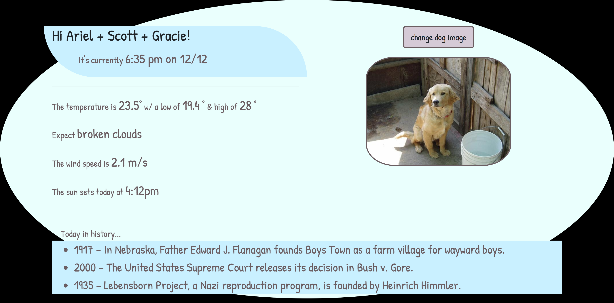

## Raspberry Pi Dashboard
### A home dashboard served w/ Flask (designed for a Raspberry Pi)

Raspberry Pi Dashboard is a Flask served home dashboard that utilizes JavaScript (axios) and several 
external APIs to provide dynamic weather updates, a daily update of historic events (from wikipedia), 
and dynamically updating dog photos (because... why not). The dashboard also provides the
date and time (to the minute). 

You will need a (free) API key from
[the open weather map](https://openweathermap.org/api) to get local weather updates. 

This is what the page looks like: 



### To serve locally (desktop)

```
git clone https://github.com/slevin886/raspberry-pi-dashboard.git
cd raspberry-pi-dashboard
python3 -m venv venv
source venv/bin/activate
export OPEN_ENV_KEY='YOUR_OPEN_WEATHER_MAP_API_KEY'
pip install -r requirements.txt
python run.py # open a browser and go to localhost:5000
```
